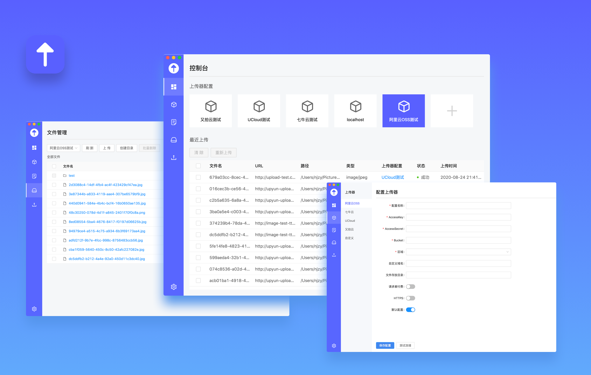

# Aragorn (WIP)

一款基于 `Electron + React + TS` 开发的文件上传及管理软件，既可以作为图床上传管理工具，也可以作为对象存储文件管理工具



## 对象存储及相关图床支持情况

|        | 上传功能 | 文件管理功能 |
| ------ | -------- | ------------ |
| 七牛云 | ✅       | ✅           |
| 又拍云 | ✅       | ✅           |
| 阿里云 | ✅       | ✅           |
| 腾讯云 | ✅       | ✅           |
| UCloud | ✅       |              |
| Github | ✅       | ✅           |

**PS** 软件还在开发中，后续会支持更多对象存储厂商及图床

## 上传器 - Uploader

为了软件的扩展性，无论是对象存储 SDK 的配置项还是以 API 形式进行使用的图床配置项都是通过一个名为 `上传器` 的概念向用户提供的，用户只需要配置一下相关上传器的参数即可轻松使用

## 开发

项目依赖安装

```bash
npm i
npm run setup
```

启动 App

```bash
npm run app:dev
npm run app:start
```

PS: 项目已经配置好了 `task.json` 和 `launch.json` ，可以直接在 vscode 中执行 task ，然后以 debug 模式启动

## 打包

```bash
npm run app:build
npm run app:dist
```

## TODO

- [x] 托盘拖拽上传
- [x] 手动选择上传
- [ ] 使用对象存储 SDK 或相关 API 进行上传
  - [x] 七牛云
  - [x] 又拍云
  - [x] UCloud
  - [x] 阿里云
  - [x] 腾讯云
  - [x] Github
- [ ] 利用对象存储 SDK 或相关 API 进行文件管理
  - [x] 阿里云
  - [x] 又拍云
  - [x] 七牛云
  - [x] 腾讯云
  - [x] Github
- [x] 自定义上传 API
- [x] 历史记录
- [x] 基本设置
  - [x] 通知开关
  - [x] 声音开关
  - [x] 自动复制
  - [x] URL 格式转换
  - [x] 自动更新
  - [x] http 代理
- [ ] 上传进度
